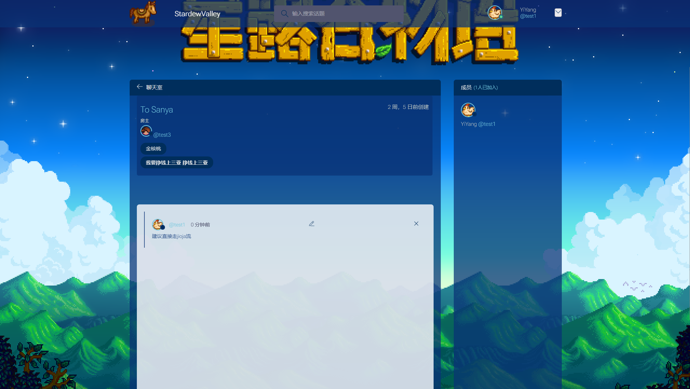
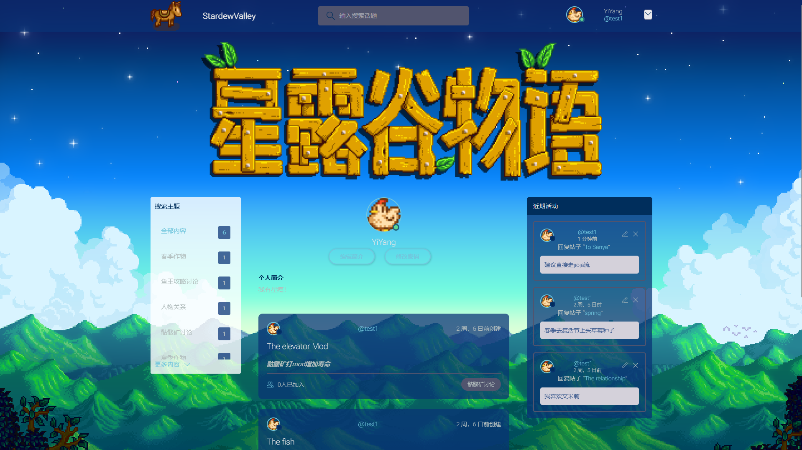

# StardewValleyForum-星露谷物语论坛

## 项目介绍：

该项目是一个纯djiango的web应用，本用于web应用课程课设，现分享出来

前端采用简单的html+css+js

后端则是一个djiango应用

实现了类似于创建帖子的主要功能

## 主要功能：

- 用户登录注册、修改密码
- 邮箱otp验证身份
- 创建、发布、搜索、评论帖子
- 上传头像等编辑个人主页

## 运行项目：

- 修改设置./Project/settings.py，包括数据库配置、系统邮箱配置

  ```python
  DATABASES = {
      'default': {
          'ENGINE': 'django.db.backends.mysql',	# Django的引擎，还可以用Oracle等，这里使用的是mysql
          'NAME': 'your_database_name',	        # 数据库名
          'USER': 'your_database_user',		    # 用户名
          'PASSWORD': 'your_database_password',	# 密码
          'HOST': '127.0.0.1',			        # 数据库服务器地址
          'PORT': 3306,		                    # 端口号（MySQL默认3306）
      }
  }
  ```

  ```python
  # email settings
  EMAIL_BACKEND = 'django.core.mail.backends.smtp.EmailBackend'   # 发送邮件配置
  EMAIL_HOST = 'your_smtp_server_name'                            # 服务器名称
  EMAIL_PORT = 465                                                # 服务端口
  EMAIL_HOST_USER = 'your_email_address'                          # 填写自己邮箱
  EMAIL_HOST_PASSWORD = 'your_email_password'                     # 在邮箱中设置的客户端授权密码，并非邮箱密码
  EMAIL_FROM = 'StardewValleyForum'                               # 收件人看到的发件人
  DEFAULT_FROM_EMAIL = EMAIL_HOST_USER
  EMAIL_USE_SSL = True                                            #是否使用SSL加密
  ```

- 命令行运行项目
  
  迁移数据库
  ```bash
  python manage.py makemigrations
  ```
  ```bash
  python manage.py migrate
  ```
  启动
  ```bash
  python manage.py runserver
  ```

### 效果图：

- 欢迎页

  

- 主页

  

- 聊天室（帖子）

  

- 个人主页

  

- 搜索话题

  

## 运行环境：

如有问题，请参考作者运行环境

python == 3.11.7

Django == 5.1.2

django-cors-headers ==  4.6.0

djangorestframework  ==3.15.2

## 结语：
欢迎大家体验、优化！
